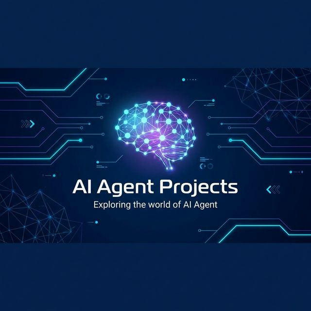

# AI_Agent_Projects (AI 智能体项目集)

  
  
  

    
  

  <h3>"Exploring the world of AI Agent"</h3>

  

    <a href="./README.md">English</a> | <b>简体中文</b>
  

---

## 🌟 项目简介

欢迎来到 **AI Agent Projects**！本仓库是我在 AI Agent 和自动化领域探索的成果结晶。这里包含了从底层爬虫到高层智能化代理的多种尝试，旨在利用 AI 技术简化复杂任务处理，提升生产力。

## 🚀 精选项目展示

| 项目名称 | 描述 | 技术栈 |
| :--- | :--- | :--- |
| **[Web Scraper](./web_scraper)** | 多平台技术文章聚合器，支持 CSDN、简书、掘金，具备自动翻译与 Markdown 报告生成功能。 | Python, Playwright, BS4 |
| **[MapleWay](./mapleway)** | 智能移民数据分析插件，自动化提取政府官网项目数据并生成对比分析。 | JavaScript, Chrome Extension |
| **[Media Scraper](./media_scraper)** | 稳健的媒体内容归档与下载工具，支持自定义配置与多平台适配。 | Python, Requests, CLI |

## 🛠️ 技术生态

  
  
  
  
  

## 📈 快速开始

每个子项目都有其独立的说明文档。请进入对应目录查看详细的安装与使用指南。

1.  **克隆仓库**: `git clone https://github.com/tancolo/AI_Agent_Projects.git`
2.  **选择项目**: 进入 `web_scraper`, `mapleway`, 或 `media_scraper`.
3.  **阅读指南**: 查看各文件夹下的 `README.md` 或 `README_CN.md`。

## 🤝 贡献指南

欢迎任何形式的贡献！如果你有新的 Agent 点子或改进建议，欢迎提交 Pull Request 或创建 Issue。

## 📄 开源协议

本项目采用 [MIT License](./LICENSE) 协议。

---

  Generated with ❤️ by <b>Antigravity</b>

